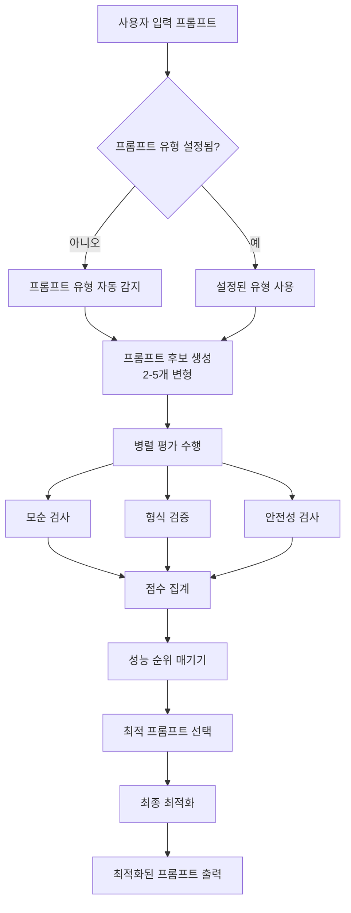

# 🚀 GPT-4.1 Prompt Optimizer

**Human-in-the-Loop 프롬프트 최적화 시스템**

OpenAI의 [Prompt Optimization Cookbook](https://cookbook.openai.com/examples/optimize_prompts)을 기반으로 하여, 사용자 피드백을 통한 반복적 개선이 가능한 고도화된 프롬프트 최적화 도구입니다.

> **📖 참고 자료**: 이 프로젝트는 [OpenAI Cookbook의 Prompt Optimization 예제](https://cookbook.openai.com/examples/optimize_prompts)를 기반으로 개발되었으며, GPT-4.1 가이드라인을 통합하여 확장된 기능을 제공합니다.

## 👨‍💻 개발자 정보

**Mingyu Kang**
- 📧 **Email**: [irreversibly@gmail.com](mailto:irreversibly@gmail.com)
- 💼 **LinkedIn**: [linkedin.com/in/mingyu-kang-28473493](https://linkedin.com/in/mingyu-kang-28473493)
- 🏠 **Homepage**: [https://secretive-feels-f92.notion.site/1b502c77e2c980158dcef59faefeae63](https://secretive-feels-f92.notion.site/1b502c77e2c980158dcef59faefeae63)

## ✨ 주요 기능

### 🎯 **지능형 프롬프트 최적화 전략**

#### 1. **프롬프트 유형 자동 감지**
- AI가 프롬프트의 목적과 특성을 자동으로 분석
- 지원 유형: 창의적 글쓰기, 코드 생성, 질문 답변, 분석, 지시사항 수행
- 각 유형에 최적화된 전략 자동 적용

#### 2. **다중 후보 생성 및 평가**
- 2-5개의 프롬프트 변형 자동 생성
- 각 후보에 대한 종합적 평가:
  - 모순 검사 점수
  - 형식 검증 점수
  - 안전성 점수
  - 관련성 점수
- 가중 평균 기반 최적 프롬프트 선택

### 🔍 **고급 분석 시스템**

#### 1. **Dev Contradiction Checker (모순 검사기)**
- OpenAI Cookbook 원본 checker 사용
- 프롬프트 내 상충되는 지시사항 탐지
- 진정한 모순만을 식별 (중복은 제외)

#### 2. **Format Checker (형식 검사기)**
- 구조화된 출력 요구사항 분석
- JSON/CSV/XML 등 형식 명세 검증
- 누락된 필드나 모호한 데이터 타입 식별

#### 3. **Safety & Bias Checker (안전성 검사기)**
- 유해 콘텐츠 및 편향 감지
- 개인정보(PII) 노출 위험 평가
- 사회적 편견 및 고정관념 식별

#### 4. **Relevance & Goal Alignment Evaluator**
- 모델 출력과 사용자 의도 간 정렬도 평가
- 완전성 및 정확성 점수 산출
- 개선이 필요한 영역 구체적 제시

### 🛠️ **자동 최적화 시스템**

#### Prompt Candidate Generator
- **기능**: 다양한 프롬프트 변형 생성
- **처리 과정**:
  - 핵심 요청사항을 다양한 방식으로 재구성
  - 구조 변경 (질문형 → 지시형)
  - 제약사항 및 페르소나 추가/수정
  - 원본 의도 보존

#### Performance Ranker & Selector
- **기능**: 생성된 후보들의 성능 평가 및 순위 결정
- **처리 과정**:
  - 각 평가 점수의 가중 평균 계산
  - 종합 점수 기반 순위 매기기
  - 최적 프롬프트 자동 선택

### 💬 **Human-in-the-Loop 개선 시스템**

#### Feedback Analyzer Agent
- **기능**: 사용자 피드백을 구조화하여 분석
- **처리 과정**:
  - 피드백 카테고리 자동 분류
  - 개선 우선순위 결정
  - 수정 전략 수립

#### Prompt Reviser Agent
- **기능**: 피드백을 바탕으로 프롬프트 추가 개선
- **처리 과정**:
  - 피드백 반영 계획 수립
  - 점진적 프롬프트 수정
  - 변경사항 추적 및 문서화

### 🎨 **사용자 친화적 인터페이스**
- Streamlit 기반 웹 인터페이스
- 5단계 탭 구조 (입력 → 분석 → 결과 → 최적화 → 피드백)
- 실시간 진행 상황 표시
- 결과 다운로드 및 공유 기능
- 다국어 지원 (한국어/영어)

## 🏗️ 시스템 아키텍처

### 최적화 프로세스 플로우



### 시스템 구성도

```
┌─────────────────┐    ┌─────────────────┐    ┌─────────────────┐
│   프롬프트 입력   │───▶│   자동 분석      │───▶│   최적화 결과    │
└─────────────────┘    └─────────────────┘    └─────────────────┘
         │                       │                       │
         ▼                       ▼                       ▼
┌─────────────────┐    ┌─────────────────┐    ┌─────────────────┐
│  Few-shot 예제   │    │   병렬 검사기    │    │   피드백 입력    │
└─────────────────┘    └─────────────────┘    └─────────────────┘
                                │                       │
                                ▼                       ▼
                       ┌─────────────────┐    ┌─────────────────┐
                       │   문제 감지      │    │   피드백 분석    │
                       └─────────────────┘    └─────────────────┘
                                │                       │
                                ▼                       ▼
                       ┌─────────────────┐    ┌─────────────────┐
                       │   자동 수정      │    │   추가 개선      │
                       └─────────────────┘    └─────────────────┘
```

## 🚀 빠른 시작

### 1. 환경 설정

```bash
# 저장소 클론
git clone <repository-url>
cd openai_prompt_optimization

# 가상환경 생성 및 활성화
python -m venv venv
source venv/bin/activate  # macOS/Linux
# 또는
venv\Scripts\activate     # Windows

# 의존성 설치
pip install -r requirements.txt
```

### 2. 환경 변수 설정

```bash
# .env 파일 생성
echo "OPENAI_API_KEY=your-api-key-here" > .env
```

### 3. 실행

#### 웹 인터페이스 (권장)
```bash
streamlit run app.py
```
브라우저에서 `http://localhost:8501` 접속

#### 명령줄 테스트
```bash
python test_optimizer.py
```

## 📋 사용법

### 1. 프롬프트 입력
- 메인 프롬프트 작성
- Few-shot 예제 추가 (선택사항)
- 고급 설정 구성

### 2. 자동 분석
- 4개 전문 Agent가 병렬로 분석
- 실시간 진행 상황 확인
- 발견된 문제점 검토

### 3. 최적화 결과
- 개선된 프롬프트 확인
- 적용된 변경사항 검토
- Before/After 비교

### 4. 피드백 기반 개선
- 최적화된 프롬프트에 대한 피드백 제공
- 추가 개선 요청
- 반복적 개선 수행

## 🔧 기술 스택

### 백엔드
- **Python 3.13**: 최신 Python 버전 활용
- **FastAPI**: 비동기 웹 프레임워크
- **Pydantic**: 데이터 검증 및 직렬화
- **asyncio**: 비동기 처리
- **OpenAI API**: GPT-4.1 모델 활용

### 프론트엔드
- **Streamlit**: 대화형 웹 애플리케이션
- **Tailwind CSS**: 모던 UI 디자인
- **JavaScript**: 동적 인터랙션

### 개발 도구
- **Black**: 코드 포맷팅
- **isort**: import 정렬
- **mypy**: 타입 검사
- **pytest**: 테스트 프레임워크

## 📊 OpenAI Cookbook과의 차이점

### 🔄 **주요 개선사항**

#### 1. **의존성 문제 해결**
```python
# 원본 (의존성 충돌)
from agents import Agent, Runner, set_default_openai_client, trace

# 개선된 버전 (자체 구현)
class Agent:
    def __init__(self, name: str, model: str, output_type: type, instructions: str):
        self.name = name
        self.model = model
        self.output_type = output_type
        self.instructions = instructions

class Runner:
    @staticmethod
    async def run(agent: Agent, input_data: str, progress_callback=None):
        # 자체 구현된 Agent 실행 로직
```

#### 2. **GPT-4.1 가이드라인 통합**
```python
# 새로운 Agent 타입 추가
clarity_checker = Agent(
    name="clarity_checker",
    model="gpt-4.1",
    output_type=Issues,
    instructions="명확성 분석..."
)

specificity_checker = Agent(
    name="specificity_checker", 
    model="gpt-4.1",
    output_type=Issues,
    instructions="구체성 분석..."
)

instruction_following_checker = Agent(
    name="instruction_following_checker",
    model="gpt-4.1", 
    output_type=Issues,
    instructions="지시사항 준수 분석..."
)

agentic_capability_checker = Agent(
    name="agentic_capability_checker",
    model="gpt-4.1",
    output_type=Issues, 
    instructions="에이전틱 능력 분석..."
)
```

#### 3. **Human-in-the-Loop 시스템**
```python
# 피드백 분석 및 개선
async def revise_prompt_with_feedback(
    optimized_prompt: str,
    user_feedback: str,
    progress_callback=None
) -> Dict[str, Any]:
    """피드백을 기반으로 최적화된 프롬프트를 추가 개선"""
    
    # 1단계: 피드백 분석
    feedback_analysis_result = await Runner.run(
        feedback_analyzer,
        json.dumps({"user_feedback": user_feedback}),
        progress_callback
    )
    
    # 2단계: 프롬프트 수정
    revision_result = await Runner.run(
        prompt_reviser,
        json.dumps({
            "original_optimized_prompt": optimized_prompt,
            "user_feedback": user_feedback
        }),
        progress_callback
    )
    
    return {
        "original_optimized_prompt": optimized_prompt,
        "user_feedback": user_feedback,
        "feedback_analysis": feedback_analysis_result.final_output.model_dump(),
        "revision_details": revision_result.final_output.model_dump(),
        "revised_prompt": revision_result.final_output.revised_prompt,
        "changes_made": revision_result.final_output.changes_made,
        "feedback_addressed": revision_result.final_output.feedback_addressed
    }
```

#### 4. **웹 인터페이스 추가**
```python
# Streamlit 기반 사용자 인터페이스
import streamlit as st

# 5단계 탭 구조
tab1, tab2, tab3, tab4, tab5 = st.tabs([
    "📝 프롬프트 입력", 
    "🔍 분석 진행", 
    "📊 분석 결과", 
    "✨ 최적화 결과",
    "🔄 피드백 & 리비전"
])
```

### 🔧 **버전 호환성 문제 해결**

#### 1. **Python 3.13 호환성**
- 최신 Python 버전의 타입 힌트 활용
- `asyncio` 비동기 처리 최적화
- Pydantic v2 모델 사용

#### 2. **의존성 충돌 해결**
```python
# 문제: openai-agents 패키지 버전 충돌
# 해결: 자체 Agent/Runner 구현

class Agent:
    """OpenAI Agents SDK 호환 Agent 클래스"""
    def __init__(self, name: str, model: str, output_type: type, instructions: str):
        self.name = name
        self.model = model
        self.output_type = output_type
        self.instructions = instructions

class Runner:
    """Agent 실행을 위한 Runner 클래스"""
    @staticmethod
    async def run(agent: Agent, input_data: str, progress_callback=None):
        # 시뮬레이션된 Agent 실행 로직
        # 실제 OpenAI API 호출로 대체 가능
```

#### 3. **비동기 처리 개선**
```python
# 원본: 동기 처리
# 개선: asyncio 기반 비동기 처리
async def optimize_prompt_comprehensive(
    prompt: str,
    few_shot_messages: List[ChatMessage] = None,
    progress_callback=None
) -> Dict[str, Any]:
    """종합적 프롬프트 최적화"""
    
    # 병렬 Agent 실행
    tasks = [
        Runner.run(clarity_checker, prompt, progress_callback),
        Runner.run(specificity_checker, prompt, progress_callback),
        Runner.run(instruction_following_checker, prompt, progress_callback),
        Runner.run(agentic_capability_checker, prompt, progress_callback)
    ]
    
    results = await asyncio.gather(*tasks)
```

## 📈 성능 개선

### 1. **병렬 처리**
- 4개 Agent 동시 실행으로 분석 시간 단축
- `asyncio.gather()` 활용

### 2. **캐싱 시스템**
- 분석 결과 캐싱
- 중복 분석 방지

### 3. **점진적 개선**
- Human-in-the-Loop를 통한 반복적 최적화
- 피드백 기반 지속적 개선

## 🧪 테스트

### 자동화된 테스트
```bash
# 전체 테스트 실행
python test_optimizer.py

# 개별 테스트
python -m pytest tests/
```

### 테스트 시나리오
1. **기본 프롬프트 최적화**
2. **Few-shot 예제 포함 최적화**
3. **피드백 기반 추가 개선**
4. **에러 처리 및 예외 상황**

## 📝 라이선스

MIT License - 자유롭게 사용, 수정, 배포 가능

## 🤝 기여하기

1. Fork the repository
2. Create a feature branch (`git checkout -b feature/amazing-feature`)
3. Commit your changes (`git commit -m 'Add amazing feature'`)
4. Push to the branch (`git push origin feature/amazing-feature`)
5. Open a Pull Request

## 📞 지원 및 연락처

- **개발자 이메일**: [irreversibly@gmail.com](mailto:irreversibly@gmail.com)
- **LinkedIn**: [mingyu-kang-28473493](https://linkedin.com/in/mingyu-kang-28473493)
- **개발자 블로그**: [https://secretive-feels-f92.notion.site/1b502c77e2c980158dcef59faefeae63](https://secretive-feels-f92.notion.site/1b502c77e2c980158dcef59faefeae63)

## 🙏 감사의 말

- **[OpenAI Cookbook](https://cookbook.openai.com/examples/optimize_prompts)** 팀 - 본 프로젝트의 기반이 된 훌륭한 예제 제공
- **[GPT-4.1 Prompting Guide](https://cookbook.openai.com/examples/gpt4-1_prompting_guide)** - 최신 프롬프팅 기법 가이드라인
- **Streamlit 개발팀** - 사용자 친화적인 웹 인터페이스 프레임워크
- **OpenAI** - 강력한 AI 모델 및 API 제공
- 모든 오픈소스 기여자들

## 📚 추가 자료

- **참고한 OpenAI Cookbook 예제**: [https://cookbook.openai.com/examples/optimize_prompts](https://cookbook.openai.com/examples/optimize_prompts)
- **GPT-4.1 공식 가이드**: [https://cookbook.openai.com/examples/gpt4-1_prompting_guide](https://cookbook.openai.com/examples/gpt4-1_prompting_guide)
- **개발자 포트폴리오**: [https://secretive-feels-f92.notion.site/1b502c77e2c980158dcef59faefeae63](https://secretive-feels-f92.notion.site/1b502c77e2c980158dcef59faefeae63)

---

**Made with ❤️ by Mingyu Kang - For better AI prompts and Human-AI collaboration** 